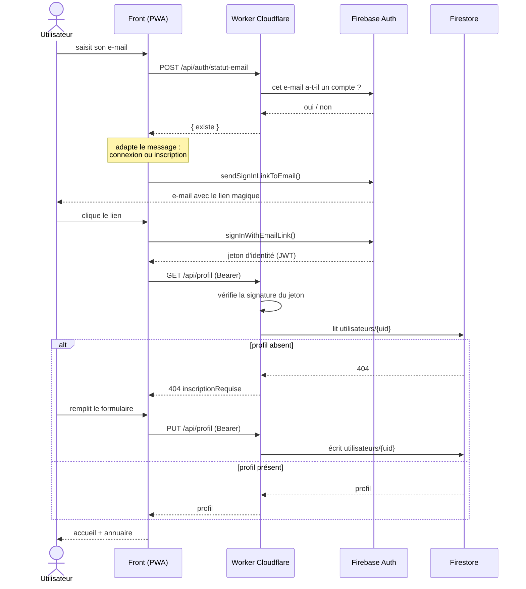

# POC J2 — Inscription et connexion par lien magique

Connexion **sans mot de passe**. L'utilisateur saisit son e-mail, reçoit un lien,
clique : il est connecté. S'il n'avait pas de compte, il en obtient un et
complète son profil dans la foulée.

- Application : https://doneo.web.app
- Backend : https://doneo-api.guillaume-lorel.workers.dev

## Les trois écrans

Ils reprennent le wireframe de la J2.

| # | Écran | Contenu |
|---|-------|---------|
| 1 | **Se connecter avec votre e-mail** | Une saisie, un bouton « Envoyer le lien magique », et la mention « Pas encore inscrit(e) ? Nous créerons un compte pour vous. » |
| 2 | **E-mail reçu** | Envoyé par Firebase. Le lien ramène sur l'application. |
| 3 | **Formulaire d'inscription** | Photo, Nom, Prénom, rôles (**donateur** et/ou **bénéficiaire**, cumulables), Adresse postale. Affiché **uniquement** si l'utilisateur n'a pas encore de profil. |

Le wireframe montrait un menu déroulant pour le type d'utilisateur. Il a été
remplacé par des **cases à cocher** : les deux rôles se cumulent, et un même
compte peut donner ce dont il n'a plus l'usage tout en cherchant autre chose.
Un menu déroulant aurait imposé un choix exclusif qui ne correspond pas au
besoin.

Un quatrième écran suit l'inscription : l'accueil, qui affiche l'annuaire des
inscrits. La J2 demande « l'inscription pas à pas **et** l'affichage des
utilisateurs » — c'est aussi la preuve visible que le profil a bien été écrit
dans Firestore.

## Qui fait quoi

## Points d'entrée du Worker

| Méthode | Chemin | Auth | Rôle |
|---------|--------|------|------|
| `GET` | `/api/health` | non | healthcheck |
| `POST` | `/api/auth/statut-email` | non | l'e-mail a-t-il déjà un compte ? |
| `GET` | `/api/profil` | **oui** | profil courant, `404` si inscription à faire |
| `PUT` | `/api/profil` | **oui** | crée ou met à jour le profil |
| `GET` | `/api/utilisateurs` | non | annuaire public |

## Décisions et leurs raisons

**Firebase envoie l'e-mail, pas nous.** Le template est intégré et gratuit.
Monter un SMTP dans le Worker aurait ajouté du travail et une source de panne,
sans rien apporter au POC.

**Le front n'écrit jamais dans Firestore.** Il présente son jeton d'identité, le
Worker en vérifie la signature avec les clés publiques de Google, puis agit avec
la clé de service. Cette clé ne quitte jamais les secrets du Worker — c'est
exactement le découpage du schéma d'architecture du cours.

**L'e-mail stocké vient du jeton, jamais du formulaire.** Sinon n'importe qui
pourrait s'enregistrer sous l'adresse d'un autre. Le champ n'est donc pas
saisissable à l'inscription : il est déjà prouvé par le lien magique.

**`GET /api/profil` répond 404 volontairement** quand le profil n'existe pas.
C'est ce qui déclenche l'affichage du formulaire côté front : un utilisateur
authentifié mais pas encore inscrit est un état normal, pas une erreur.

**Le CORS n'utilise plus de joker.** Le Worker ne renvoie l'origine que si elle
correspond au domaine de l'application, ou à un `localhost` pour le développement.
Une origine inconnue ne reçoit aucun en-tête d'autorisation.

**Vérification complète du jeton, pas seulement la signature.** Expiration,
date d'émission, audience et émetteur sont contrôlés. Une signature valide
émise pour un autre projet Firebase serait sinon acceptée.

## Cas gérés

- E-mail syntaxiquement invalide → refus immédiat, sans appel réseau inutile.
- **Lien ouvert sur un autre appareil** que celui de la demande : l'adresse
  n'est plus en mémoire locale, l'application la redemande au lieu d'échouer.
  C'est le cas le plus fréquent en usage réel — demande sur ordinateur,
  ouverture sur téléphone.
- Lien expiré ou déjà consommé → message explicite.
- Navigation privée / stockage bloqué → l'application redemande l'adresse.
- Le code à usage unique est retiré de l'URL après connexion, pour qu'il ne
  reste ni dans l'historique ni rejouable au rafraîchissement.
- Champs du profil validés côté serveur, pas seulement dans le navigateur.

## Hors périmètre pour la J2

- **Photo de profil** : l'emplacement est affiché, l'envoi vers R2 viendra avec
  la fonctionnalité « Stockage des photos », classée SHOULD.
- Renvoi du lien avec compte à rebours, limitation du nombre de demandes.
- Sessions en base D1 : Firebase gère déjà la session côté client.
- Modification et suppression du profil.
