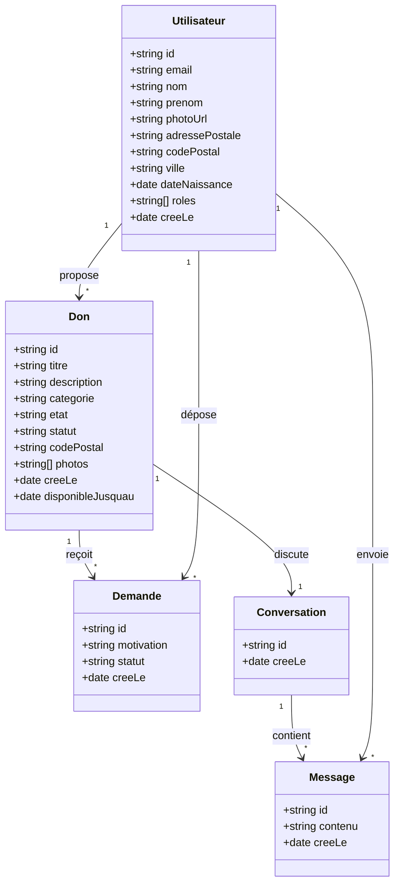

# Modèle de données — DON (dons entre particuliers)

Deux rôles qui se répondent : des **donateurs** cèdent gratuitement des objets
dont ils n'ont plus l'usage, des **bénéficiaires** — l'application vise surtout
les jeunes dans le besoin, étudiants qui s'installent, personnes en difficulté —
en font la demande et viennent les récupérer.

**Les deux rôles se cumulent.** Un même compte peut donner ce dont il n'a plus
l'usage tout en cherchant autre chose : c'est le cas courant entre étudiants.
D'où un champ `roles` sous forme de **liste**, et non un type unique.

Aucun argent ne circule : ni prix, ni enchère, ni commission. La plateforme est
un intermédiaire de confiance, pas une place de marché.

Diagramme de classes (à éditer sur mermaidchart.com ou dans l'IDE).

## Notes métier

- Un **Don** appartient à un **Utilisateur** donateur. Il n'a **pas de prix** :
  la valeur est l'usage, pas le montant.
- Une **Demande** est déposée par un bénéficiaire. Elle porte une `motivation`
  libre : c'est elle, et non un montant, qui départage plusieurs demandeurs.
  Le donateur choisit — il n'y a pas d'attribution automatique.
- Le **statut** d'un Don suit son cycle de vie : `disponible`, `reserve`
  (une demande acceptée), `remis` (l'objet a changé de mains).
- Le **statut** d'une Demande : `en_attente`, `acceptee`, `refusee`.
- La **Conversation** lie donateur et bénéficiaire pour convenir du retrait.
- Le **codePostal** porte la proximité : les objets se récupèrent en main
  propre, donc la distance est un critère de recherche déterminant. Avec la
  **ville**, c'est la seule partie de l'adresse rendue publique — elle figure
  sur chaque carte de l'annuaire. L'**adressePostale**, elle,
  ne sort jamais du profil : elle ne servira qu'au moment de convenir d'un
  retrait, entre les deux personnes concernées.

## Énumérations

| Champ | Valeurs |
|-------|---------|
| `roles` | liste non vide parmi `donateur`, `beneficiaire` |
| `Don.statut` | `disponible`, `reserve`, `remis` |
| `Don.etat` | `neuf`, `tres_bon`, `bon`, `usage` |
| `Demande.statut` | `en_attente`, `acceptee`, `refusee` |

## Ce que le modèle ne contient pas, volontairement

- **Aucun champ monétaire.** Pas de prix, pas de montant d'enchère, pas de
  date de clôture d'enchère. Le don est gratuit et sans échéance imposée.
  ⚠️ **Point rouvert par le client** — voir ci-dessous.
- **Aucune cause caritative bénéficiaire.** Le don va directement d'une
  personne à une autre, sans association intermédiaire ni reversement.

## ⚠️ Décisions en attente

Ce modèle n'est pas figé. Le client (Quang TRAN) a rouvert deux points par
e-mail au PO le **11/09/2026** :

1. **Paiement symbolique fixé par le donateur.** Motif : donner le sentiment
   d'un échange et limiter les abus. « Ce serait bien de l'avoir. » Cela
   contredit directement la ligne « Aucun champ monétaire » ci-dessus et
   ajouterait un montant au `Don`.
2. **Charge de gestion du donateur.** Consulter et valider les profils des
   demandeurs alourdit l'effort côté donateur. Alternative évoquée pour
   l'alléger : créneau de retrait fixé, questions publiques, acceptation
   automatique — au prix de la dimension solidarité portée par la `motivation`.

Le client harmonise par ailleurs la difficulté entre les projets des différents
groupes : le périmètre peut donc bouger indépendamment de nos choix.

**Rien n'est tranché** : ces points attendent une décision du PO. Tant qu'elle
n'est pas prise, le modèle ci-dessus reste la référence.
