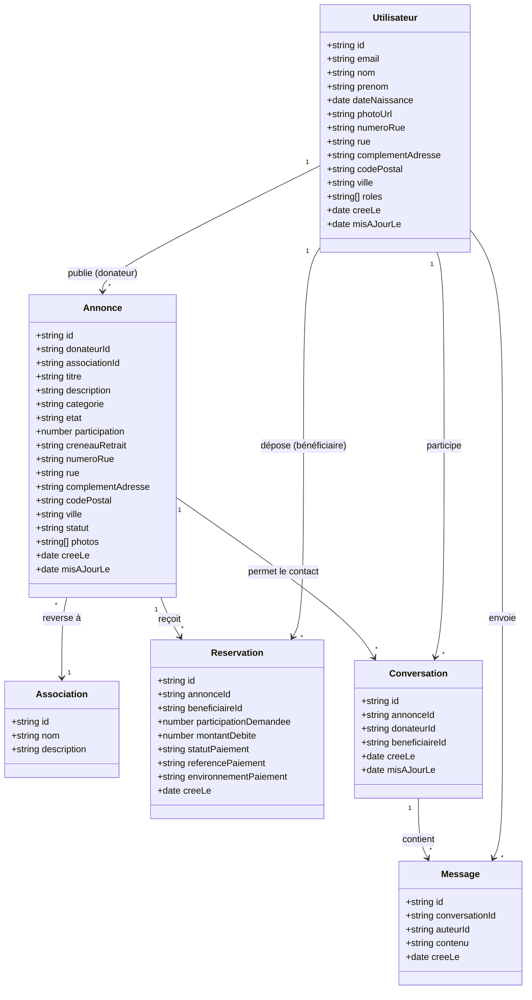

# Modèle de données — Donéo (vente caritative d'objets)

Don caritatif via la vente d'objets : le **donateur** cède un objet et fixe une
**participation solidaire** — un montant modeste — puis choisit une
**association**. Le **bénéficiaire** verse cette participation et repart avec
l'objet ; **l'argent, lui, va intégralement à l'association**.

Trois acteurs, et il faut bien séparer qui reçoit quoi :

| Acteur           | Ce qu'il fait                                                                                        | Ce qu'il reçoit                                                            |
| ---------------- | ---------------------------------------------------------------------------------------------------- | -------------------------------------------------------------------------- |
| **Donateur**     | Cède un objet, fixe la participation solidaire, choisit l'association, définit le créneau de retrait | **Rien.** Il ne touche pas l'argent : c'est ce qui fait de la vente un don |
| **Bénéficiaire** | Un étudiant, ou une personne dans le besoin. Verse la participation et vient chercher l'objet        | **L'objet**, à petit prix                                                  |
| **Association**  | Choisie par le donateur parmi une liste                                                              | **L'argent** versé par le bénéficiaire                                     |

La participation n'est pas un prix de marché : elle reste **modeste**, pour que
l'objet demeure accessible à qui en a besoin. Ce qu'elle achète, ce n'est pas la
valeur de l'objet — c'est le geste de soutenir une association.

**Les rôles `donateur` et `beneficiaire` se cumulent** sur un même compte : on
peut céder un objet au profit d'une association tout en en acquérant un autre.
D'où un champ `roles` sous forme de **liste**, et non un type unique.

## Perimetre Pre-J3 — scenario minimal

Le scenario minimal couvre le parcours evalue de bout en bout :

1. Un utilisateur cree son profil et choisit un ou plusieurs roles.
2. Un donateur publie une annonce avec une participation, une association et
   un creneau de retrait.
3. Un beneficiaire recherche une annonce par texte, ville ou code postal et
   consulte uniquement son adresse approximative.
4. Le beneficiaire contacte le donateur, puis reserve l'objet.
5. La participation est validee en mode test et l'adresse exacte devient
   disponible dans la confirmation de reservation.

Les favoris, la recherche par distance, le calendrier avance, les avis, le
stockage de fichiers et les notifications sont hors scenario minimal. Ils sont
reserves aux lots `SHOULD` et `COULD` de la roadmap.

## Notes métier

- **Utilisateur** a un ou plusieurs `roles` cumulables : `donateur`,
  `beneficiaire`.
- **Annonce** : un objet cédé par un donateur. `participation` est
  **obligatoire (> 0)** et versée à l'**Association** choisie. `statut` :
  `disponible` / `reserve` / `remis`.
- **Participation** : le montant demandé au bénéficiaire. Il se veut **modeste**
  — c'est une contribution à une cause, pas le prix de l'objet. Aucun plafond
  technique n'est imposé : la modération relève de l'usage, pas du contrôle.
- **Association** : destinataire de l'argent, choisie par le donateur dans une
  liste. (Remplace l'ancienne entité `Cause`.)
- **Créneau** : `creneauRetrait` = tranche horaire ponctuelle de retrait définie
  par le donateur.
- **Reservation** : le bénéficiaire verse la participation et met l'objet de
  côté. `statutPaiement = paye` débloque l'adresse exacte. Le terme
  « réservation » est préféré à « acquisition » : il dit que l'objet est mis de
  côté jusqu'au retrait, sans évoquer un achat.

> **Tous les champs sont en français**, y compris les clés étrangères
> (`donateurId`, `associationId`, `beneficiaireId`) et les valeurs
> d'énumération. Aucun champ en anglais ne doit réapparaître.

### Adresse de l'utilisateur, décomposée

L'adresse n'est pas une chaîne unique : elle est éclatée en champs, ce qui
permet de n'en publier qu'une partie et de préremplir une annonce sans ressaisie.

| Champ               | Exemple             | Visibilité            |
| ------------------- | ------------------- | --------------------- |
| `numeroRue`         | `14 bis`            | 🔒 privé              |
| `rue`               | `rue de la Charité` | 🔒 privé              |
| `complementAdresse` | `Bât. B, appt 12`   | 🔒 privé — facultatif |
| `codePostal`        | `69002`             | 🌍 **public**         |
| `ville`             | `Lyon`              | 🌍 **public**         |

`numeroRue` est une **chaîne**, pas un nombre : « 14 bis », « 3-5 » et « 12 ter »
sont des numéros valides.

### Adresse à deux niveaux

**L'annonce porte exactement les mêmes cinq champs d'adresse que l'utilisateur.**
Un seul vocabulaire, donc, et la possibilité de préremplir une annonce depuis le
profil du donateur sans ressaisie. Le principe est identique des deux côtés : on
publie de quoi juger la proximité, jamais de quoi se présenter à la porte.

- **Niveau public** — `codePostal` + `ville`. Visible **avant** paiement, et
  même sans être connecté pour l'annuaire.
- **Niveau privé** — `numeroRue` + `rue` + `complementAdresse`. Côté annonce,
  ces trois champs ne sont révélés qu'**après paiement** ; ils ne doivent
  **jamais** sortir d'une route publique. Côté utilisateur, ils ne sortent
  jamais du tout.

Filtrage par **liste blanche** : on n'énumère que les champs autorisés à sortir,
jamais les champs à cacher — sinon tout champ ajouté plus tard fuite par défaut.

## Paiement : réel en mode test

Le paiement **passe par un vrai prestataire** (Stripe ou équivalent), mais
**uniquement en mode test**. Il est donc réellement validé — il y a un tunnel de
paiement, une confirmation, une référence de transaction — sans qu'aucun euro ne
change de main, et sans le moindre reversement réel à l'association.

| Champ                   | Rôle                                                                                                                                                                                              |
| ----------------------- | ------------------------------------------------------------------------------------------------------------------------------------------------------------------------------------------------- |
| `participationDemandee` | La **vraie** participation, celle que voit le bénéficiaire. Recopiée depuis `Annonce.participation` au moment de la réservation, pour qu'une modification ultérieure ne réécrive pas l'historique |
| `montantDebite`         | Ce qui est réellement prélevé : **0**                                                                                                                                                             |
| `statutPaiement`        | `en_attente` → `paye` (ou `echoue`). Le passage à `paye` est ce qui débloque l'adresse exacte                                                                                                     |
| `referencePaiement`     | Identifiant renvoyé par le prestataire, preuve que le tunnel a bien été parcouru                                                                                                                  |
| `environnementPaiement` | `test`. Rend explicite en base qu'aucune transaction réelle n'a eu lieu                                                                                                                           |

> ⚠️ **Limite technique à connaître.** Stripe refuse les paiements d'un montant
> nul (minimum de l'ordre de 0,50 €). Deux façons de tenir « montant payé = 0 » :
> soit on envoie `participationDemandee` au prestataire en mode test — aucun
> argent réel ne bouge de toute façon, et `montantDebite` reste à 0 en base ;
> soit on court-circuite le prestataire quand la participation est faible. La
> première est la plus simple et la plus démontrable. **À trancher avant
> d'implémenter.**
