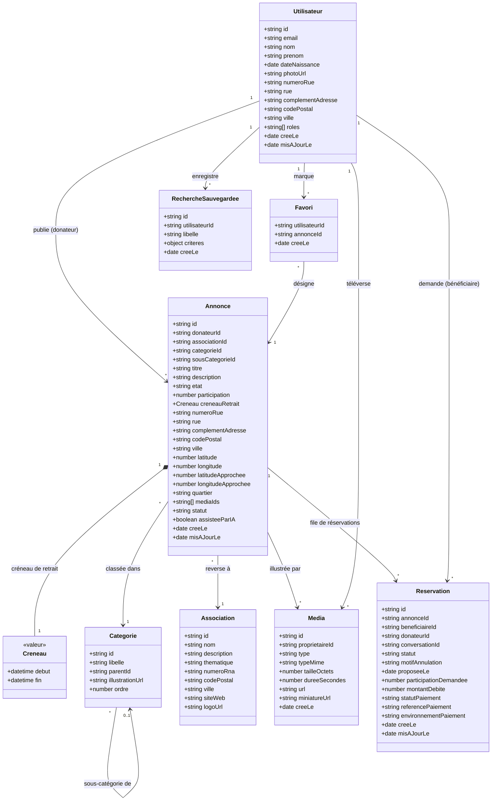
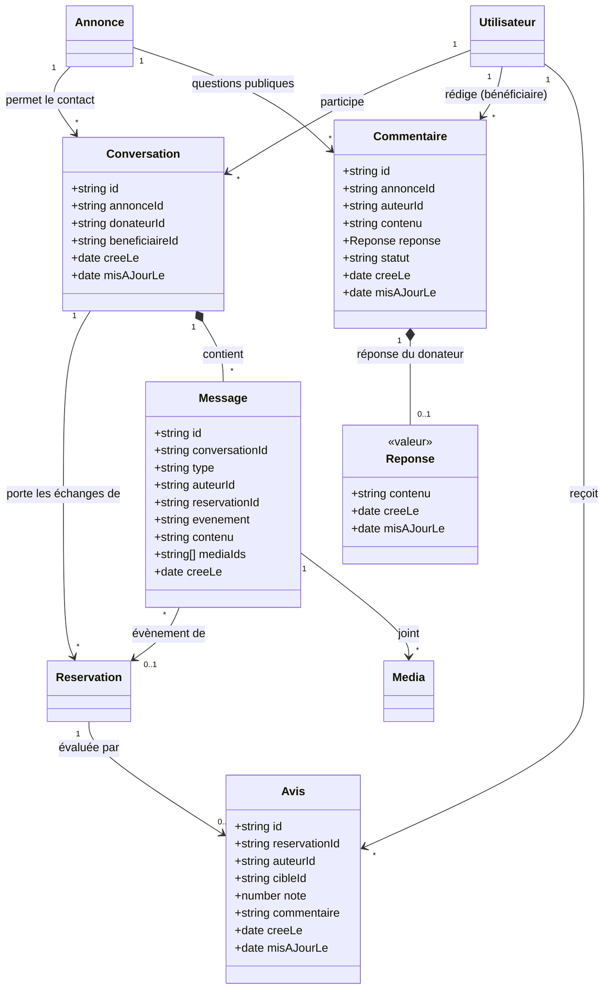
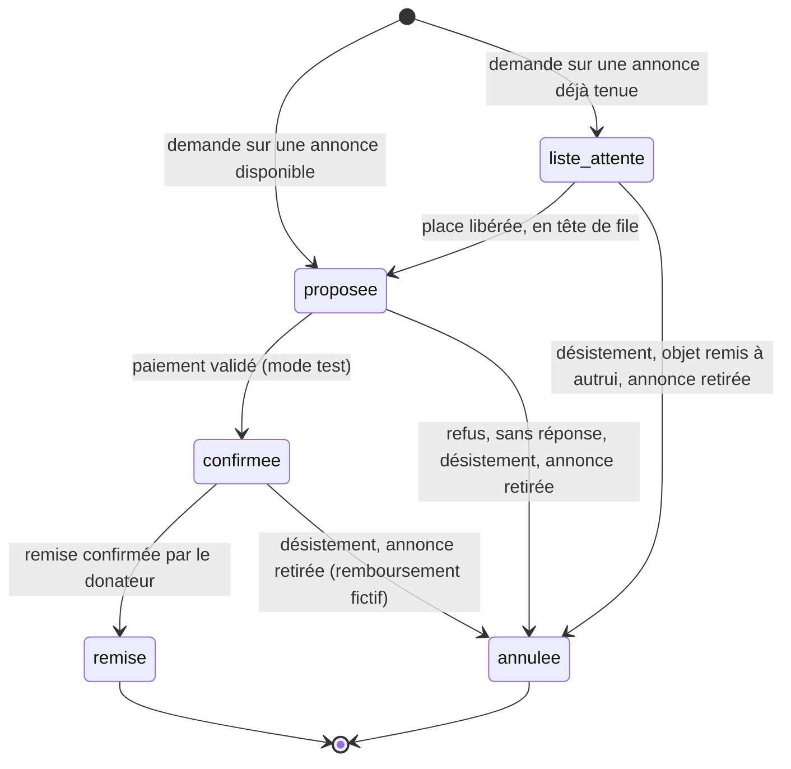
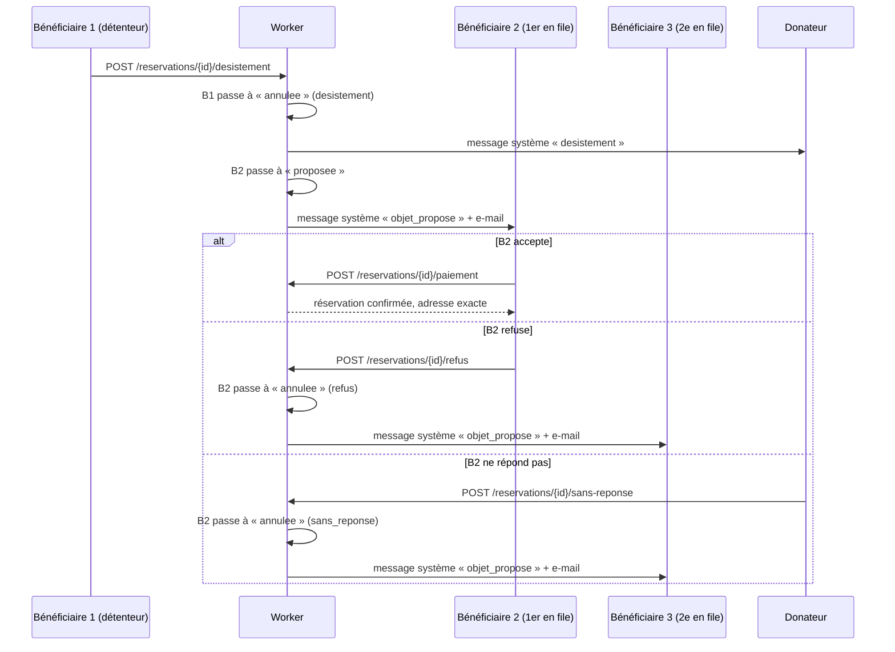

# Modèle de données — Donéo (vente caritative d'objets)

Don caritatif via la vente d'objets : le **donateur** cède un objet et fixe une
**participation solidaire** — un montant modeste — puis choisit une
**association**. Le **bénéficiaire** verse cette participation et repart avec
l'objet ; **l'argent, lui, va intégralement à l'association**.

Trois acteurs, et il faut bien séparer qui reçoit quoi :

| Acteur           | Ce qu'il fait                                                                                        | Ce qu'il reçoit                                                            |
| ---------------- | ---------------------------------------------------------------------------------------------------- | -------------------------------------------------------------------------- |
| **Donateur**     | Cède un objet, fixe la participation solidaire, choisit l'association, définit le créneau de retrait | **Rien.** Il ne touche pas l'argent : c'est ce qui fait de la vente un don |
| **Bénéficiaire** | Un étudiant, ou une personne dans le besoin. Verse la participation et vient chercher l'objet        | **L'objet**, à petit prix                                                  |
| **Association**  | Choisie par le donateur parmi une liste                                                              | **L'argent** versé par le bénéficiaire                                     |

La participation n'est pas un prix de marché : elle reste **modeste**, pour que
l'objet demeure accessible à qui en a besoin. Ce qu'elle achète, ce n'est pas la
valeur de l'objet — c'est le geste de soutenir une association.

**Les rôles `donateur` et `beneficiaire` se cumulent** sur un même compte : on
peut céder un objet au profit d'une association tout en en réservant un autre.
D'où un champ `roles` sous forme de **liste**, et non un type unique.

## Ce qui change — version 0.3 (retours clients du 17/09/2026)

Le modèle intègre les demandes des « clients » transmises par Quang TRAN, et
deux règles métier ajoutées par l'équipe :

| Demande                                        | Origine        | Traduction dans le modèle                                                    |
| ---------------------------------------------- | -------------- | ---------------------------------------------------------------------------- |
| Capture photo, vidéo, vocal                    | Clients        | Entité **`Media`**, jointe aux annonces et aux messages                      |
| Création assistée d'annonce avec IA            | Clients        | Route de **brouillon** : l'IA propose, le donateur valide et publie          |
| Informations locales (météo, quartiers, lieux) | Clients        | **Contexte local** calculé ; position publique ramenée au **quartier IRIS**  |
| Messagerie contextuelle et actionnable         | Clients        | **Messages système** rattachés à une réservation                             |
| Avis                                           | Clients        | Entité **`Avis`**, déposée après la remise de l'objet                        |
| Géolocalisation, favoris, recherche avancée    | Priorisation   | Coordonnées, entité **`Favori`**, filtres et tris, recherches sauvegardées   |
| Catégories à deux niveaux                      | Barème         | Entité **`Categorie`** hiérarchique, en remplacement de l'énumération figée  |
| Commentaires publics sur les annonces          | Équipe         | Entité **`Commentaire`** : une question, une réponse du donateur             |
| Liste d'attente en cas de désistement          | Équipe         | **`Reservation`** devient une machine à états ; le suivant accepte ou refuse |

Deux changements cassent le contrat précédent — sans conséquence, puisque
aucune route d'annonce ni de réservation n'est encore codée :

- **On ne paie plus en réservant**, mais quand l'objet vous est _proposé_. La
  route unique `POST /api/annonces/{id}/reservation` se scinde en une demande,
  puis une confirmation par paiement.
- **`creneauRetrait` devient un intervalle daté** (`debut`, `fin`) au lieu d'une
  chaîne libre. Sans date exploitable, impossible de savoir si le créneau est
  terminé, de trier par créneau, ou de recevoir le créneau généré par l'IA.

## Périmètre et priorités

La priorisation transmise par les clients est **indicative** : elle se discute
et se valide avec le PO. Elle sert ici à situer chaque entité.

| Priorité         | Fonctionnalités                                                                     | Entités et routes concernées                         |
| ---------------- | ----------------------------------------------------------------------------------- | ---------------------------------------------------- |
| **Socle Pré-J3** | Profil, publication, recherche simple, contact, réservation payée en mode test      | `Utilisateur`, `Annonce`, `Reservation`, `Message`   |
| **MUST**         | Géolocalisation et proximité, favoris, recherche et tri avancés, statut des annonces, stockage des documents | coordonnées de l'`Annonce`, `Favori`, `Media` |
| **SHOULD**       | Préférences de recherche, options et statut de réservation                          | `RechercheSauvegardee`, liste d'attente              |
| **COULD**        | Messagerie actionnable, commentaires et avis, capture média, création IA, notation  | messages système, `Commentaire`, `Avis`, route IA    |
| **COULD FAKE**   | Paiement, vérification d'identité                                                   | paiement réel en mode test, lien magique             |
| **WON'T**        | Notifications non lues, multilingue, forum, SSO, fidélité                           | _volontairement absents du modèle_                   |

Les **WON'T** ne sont pas des oublis. Il n'y a pas de champ `lu` sur les
messages, et les commentaires n'ont qu'un niveau de réponse : c'est ce qui les
empêche de glisser vers un forum.

## Diagrammes de classes

Deux vues, pour rester lisibles : le **cœur métier** — ce qu'on publie et ce
qu'on réserve — puis les **échanges** entre membres. Une classe présente dans
les deux vues n'est détaillée que dans la première.

### Cœur métier

### Échanges entre membres

## Notes par entité

- **Utilisateur** — inchangé. Un ou plusieurs `roles` cumulables :
  `donateur`, `beneficiaire`.
- **Annonce** — un objet cédé par un donateur. `participation` est
  **obligatoire (> 0)** et versée à l'**Association** choisie. `statut` :
  `disponible` / `reserve` / `remis` / `retiree`. Une annonce `reserve` accepte
  encore des inscriptions en **liste d'attente**. `assisteeParIA` trace les
  annonces dont le brouillon a été généré par l'IA.
- **Participation** — le montant demandé au bénéficiaire. Il se veut
  **modeste** : c'est une contribution à une cause, pas le prix de l'objet.
  Aucun plafond technique n'est imposé : la modération relève de l'usage, pas du
  contrôle.
- **Categorie** — hiérarchique à deux niveaux : une catégorie principale a
  `parentId = null`, une sous-catégorie pointe vers sa principale. L'annonce
  porte les deux identifiants, pour filtrer à l'un ou l'autre niveau.
  `illustrationUrl` fournit la **photo par défaut** d'une annonce sans média.
- **Association** — destinataire de l'argent, choisie par le donateur.
  Enrichie pour être alimentée depuis le **Répertoire national des associations**
  (`numeroRna`), données ouvertes filtrées sur la Métropole de Lyon.
  `thematique` fournit une seconde liste de filtrage.
- **Creneau** — valeur, pas entité : un intervalle `debut` → `fin`, avec
  `fin > debut` et `debut` dans le futur à la publication.
- **Media** — un fichier stocké sur R2 (`doneo-fichiers`). `type` : `photo`,
  `video` ou `audio`. On stocke ses métadonnées pour vérifier qu'un utilisateur
  ne joint que **ses propres** fichiers.
- **Reservation** — voir la machine à états ci-dessous. `donateurId` est recopié
  depuis l'annonce pour lister simplement « les demandes reçues ».
  `conversationId` est **toujours renseigné** : c'est là que tombent les
  messages système qui concernent la réservation.
- **Conversation** — privée, entre un donateur et un bénéficiaire, **unique par
  couple (annonce, bénéficiaire)**. Elle peut précéder toute réservation, et
  survivre à plusieurs : après un désistement, on peut se réinscrire.
- **Message** — `type` : `utilisateur` ou `systeme`. Un message système n'a pas
  d'`auteurId` ; il porte un `evenement` et la `reservationId` concernée, ce qui
  permet au front d'afficher les boutons d'action (payer, refuser, se désister).
  Il faut au moins un `contenu` ou un média.
- **Commentaire** — public, lisible sans être connecté. Voir plus bas.
- **Avis** — une note de 1 à 5 et un commentaire facultatif, déposés après la
  remise. Voir plus bas.
- **Favori** — identifié par le couple (`utilisateurId`, `annonceId`) : pas
  d'identifiant propre, pas de doublon possible.
- **RechercheSauvegardee** — les « préférences de recherche » : un libellé et
  les critères, rejouables en un clic.

> **Tous les champs sont en français**, y compris les clés étrangères
> (`donateurId`, `associationId`, `beneficiaireId`) et les valeurs
> d'énumération. Aucun champ en anglais ne doit réapparaître.

## Réservation et liste d'attente

Une annonce est « tenue » par au plus **une** réservation à la fois — proposée
ou confirmée. Les demandes suivantes s'inscrivent en **liste d'attente**, dans
l'ordre d'arrivée. Quand le détenteur se désiste ou refuse, l'objet est
**proposé au suivant**, qui doit à son tour accepter en payant, ou refuser. Et
ainsi de suite. **Il n'y a pas de délai automatique** : si la personne ne
répond pas, c'est le **donateur** qui passe au suivant, d'un bouton.

**L'annonce passe à `reserve` dès la proposition**, et non au paiement : sinon,
une seconde demande arrivant avant le paiement du premier obtiendrait
elle aussi `proposee`, et deux personnes tiendraient le même objet. Elle reste
`reserve` tant que quelqu'un tient l'objet **ou attend** dans la file, et
redevient `disponible` quand plus personne ne le tient ni ne l'attend.

| `statut`        | Sens                                                               | Adresse exacte visible ? |
| --------------- | ------------------------------------------------------------------ | ------------------------ |
| `liste_attente` | Inscrit derrière le détenteur actuel ; `position` calculée          | Non                      |
| `proposee`      | L'objet vous est proposé : payer pour accepter, ou refuser          | Non                      |
| `confirmee`     | Participation validée, retrait attendu                              | **Oui**, au bénéficiaire |
| `remise`        | L'objet a changé de mains ; les avis s'ouvrent                     | Non                      |
| `annulee`       | Fin sans remise ; la raison est dans `motifAnnulation`             | Non                      |

`motifAnnulation` : `desistement`, `refus`, `sans_reponse`,
`attribuee_a_autrui`, `annonce_retiree`. On garde **un seul** état terminal
d'échec plutôt que trois : la raison change le message affiché, pas ce qu'on
peut faire ensuite.

### Ce qui se passe quand quelqu'un se désiste

### Règles de la file

Les valeurs chiffrées sont des **propositions à valider** avec le PO.

| Règle                                                        | Valeur proposée                                         |
| ------------------------------------------------------------ | ------------------------------------------------------- |
| Taille maximale de la liste d'attente                        | **5** personnes                                         |
| Réservations en cours simultanées par bénéficiaire           | **3**, liste d'attente comprise — contre l'accaparement |
| Réservation en cours par couple (annonce, bénéficiaire)      | **1** ; après un désistement, on repasse en fin de file |

- **Pas de délai automatique, donc pas de tâche planifiée.** Un compte à rebours
  demanderait une échéance calculée, une tâche qui tourne en fond et des règles
  pour les créneaux trop courts. On laisse plutôt la main au donateur : il voit
  depuis quand l'objet est proposé (`proposeeLe`) et passe au suivant s'il
  n'a pas de nouvelles.
- **On ne réserve pas une annonce dont le créneau est terminé** (409). Le
  donateur le reporte en modifiant l'annonce, et le détenteur en est prévenu
  par un message `creneau_modifie`.
- **Le plafond de 3 compte aussi la liste d'attente.** Ne compter que les
  réservations proposées ou confirmées laisserait s'inscrire dans d'autres
  files, puis dépasser le plafond au moment des promotions, qui ne peuvent pas
  être refusées pour ce motif sans léser la file. Compter toutes les
  réservations en cours garantit que le plafond tient à tout instant.
- **La demande et la promotion sont transactionnelles.** Deux demandes
  simultanées sur une annonce disponible ne doivent pas produire deux
  réservations `proposee` : la lecture du statut de l'annonce, l'écriture de la
  réservation et le passage à `reserve` se font dans une même transaction
  Firestore.
- **Quand une proposition prend fin sans remise** — refus, sans réponse,
  désistement — l'objet passe au suivant ; si la file est vide, l'annonce
  redevient `disponible`.
- **`participationDemandee` est figée au moment de la proposition**, et non à
  l'inscription en file : c'est le montant affiché quand on vous demande de
  payer. Pour éviter toute surprise, `participation` et `associationId` ne sont
  plus modifiables dès qu'une réservation non annulée existe.
- **Un désistement après paiement ne se rattrape pas côté vie privée** : la
  personne a vu l'adresse exacte. C'est un risque résiduel assumé, que seul un
  point de rencontre public éviterait (voir les questions ouvertes).
- **La remise clôt la file** : toutes les réservations encore en attente passent
  à `annulee` (`attribuee_a_autrui`), avec un message système.

### Comment on prévient, sans notifications

« Notifications non lues / alertes mobiles » est classé **WON'T**. On n'ajoute
donc ni badge, ni push, ni champ `lu`. Mais une personne promue depuis la file
n'a aucune raison d'ouvrir l'application d'elle-même :

1. **Toujours** : un message système `objet_propose` dans sa conversation. C'est
   la « messagerie actionnable » des maquettes clients : le message porte les
   boutons _Payer pour confirmer_ et _Refuser_.
2. **Recommandé** : un **e-mail transactionnel** pour ce seul évènement, par le
   SMTP Brevo déjà ouvert. Sans lui, la file devient injuste : le donateur
   risque de passer au suivant avant que la personne sache qu'elle a été
   choisie. **À trancher avec le PO.**

`evenement` des messages système : `demande_en_file`, `objet_propose`,
`paiement_valide`, `refus`, `desistement`, `sans_reponse`, `objet_remis`,
`attribuee_a_autrui`, `creneau_modifie`, `annonce_retiree`.

## Commentaires publics

Les bénéficiaires peuvent poser une question sous une annonce ; le donateur y
répond. C'est public, et c'est volontairement distinct de la messagerie privée :

|              | Commentaire                      | Conversation                        |
| ------------ | -------------------------------- | ----------------------------------- |
| Visibilité   | **Publique**, même non connecté  | Privée, deux participants           |
| Rédaction    | Bénéficiaire ; réponse du donateur | Les deux parties                  |
| Profondeur   | **Une question, une réponse**    | Fil continu                         |
| Usage        | « Est-ce que ça rentre dans une Clio ? » — utile à tous | Organiser le retrait |

- **Un seul niveau de réponse**, portée par le commentaire lui-même
  (`reponse`). Pas de réponse à la réponse : un fil de discussion public est un
  forum, classé WON'T.
- **Le donateur ne commente pas sa propre annonce** : il y répond. Une personne
  aux deux rôles peut commenter les annonces des autres.
- La réponse est **unique mais modifiable** par le donateur.
- **Modération minimale** : l'auteur supprime son commentaire ; le donateur peut
  **masquer** un commentaire sur son annonce (`statut` : `visible` /
  `masque`). Un commentaire masqué disparaît pour le public, reste visible du
  donateur, et peut être rétabli.
- On ne commente plus une annonce `remis` ou `retiree`.
- **L'adresse exacte ne doit pas y fuiter.** Rien n'empêche techniquement un
  donateur d'écrire sa rue dans une réponse : l'interface l'en avertit au moment
  de répondre.

## Avis

- Ouverts **uniquement** sur une réservation `remise`.
- **Réciproques** : le bénéficiaire note le donateur, et le donateur peut noter
  le bénéficiaire — utile contre les absences au rendez-vous. D'où la
  cardinalité **0..2** : un avis au plus par partie et par réservation.
- `note` entière de 1 à 5, `commentaire` facultatif de 500 caractères au plus.
  L'avis reste **modifiable** par son auteur, comme sur les maquettes clients.
- Le profil public affiche `noteMoyenne` et `nombreAvis`, calculés.

## Médias

| `type`  | Formats acceptés         | Limite                  | Où             |
| ------- | ------------------------ | ----------------------- | -------------- |
| `photo` | JPEG, PNG, WebP          | 5 Mo                    | Annonce, message |
| `video` | MP4, WebM                | 30 s et 25 Mo           | Annonce, message |
| `audio` | WebM, Ogg, M4A           | 60 s et 5 Mo            | Annonce, message |

- Une annonce porte **8 médias au plus, dont une seule vidéo** ; un message, 4.
- Le téléversement est **séparé** de la publication : on envoie le fichier, on
  reçoit un identifiant, puis on le cite dans l'annonce ou le message. C'est ce
  qui permet la capture directe depuis l'appareil photo avant même d'avoir saisi
  le titre.
- Un média jamais rattaché au bout de 24 h est un orphelin, à purger.

## Géolocalisation sans trahir l'adresse

La proximité est un **MUST**, mais une coordonnée précise, c'est l'adresse
exacte. D'où deux niveaux, calqués sur ceux de l'adresse :

| Champ                                        | Source                                        | Visibilité                           |
| -------------------------------------------- | --------------------------------------------- | ------------------------------------ |
| `latitude`, `longitude`                      | Géocodage de l'adresse complète (API Adresse) | 🔒 **jamais exposées**               |
| `latitudeApprochee`, `longitudeApprochee`    | Centroïde du **quartier IRIS**                | 🌍 publiques                         |
| `quartier`                                   | Libellé IRIS de la Métropole de Lyon          | 🌍 public                            |

- **Toute distance renvoyée est calculée sur la position approchée, puis
  arrondie à 0,5 km** — « à moins d'un kilomètre » en deçà. Une distance exacte,
  interrogée depuis trois points différents, suffit à trianguler un domicile.
- Hors de la Métropole de Lyon, où les contours IRIS ne sont pas fournis, la
  position approchée retombe sur le **centroïde du code postal**.
- La position de celui qui cherche n'est **jamais stockée** : le front la passe
  en paramètre, ou on part du centroïde de son code postal.

### Adresse de l'utilisateur, décomposée

L'adresse n'est pas une chaîne unique : elle est éclatée en champs, ce qui
permet de n'en publier qu'une partie et de préremplir une annonce sans ressaisie.

| Champ               | Exemple             | Visibilité            |
| ------------------- | ------------------- | --------------------- |
| `numeroRue`         | `14 bis`            | 🔒 privé              |
| `rue`               | `rue de la Charité` | 🔒 privé              |
| `complementAdresse` | `Bât. B, appt 12`   | 🔒 privé — facultatif |
| `codePostal`        | `69002`             | 🌍 **public**         |
| `ville`             | `Lyon`              | 🌍 **public**         |

`numeroRue` est une **chaîne**, pas un nombre : « 14 bis », « 3-5 » et « 12 ter »
sont des numéros valides.

### Adresse à deux niveaux

**L'annonce porte exactement les mêmes cinq champs d'adresse que l'utilisateur.**
Un seul vocabulaire, donc, et la possibilité de préremplir une annonce depuis le
profil du donateur sans ressaisie. Le principe est identique des deux côtés : on
publie de quoi juger la proximité, jamais de quoi se présenter à la porte.

- **Niveau public** — `codePostal`, `ville`, `quartier` et la position
  approchée. Visibles **avant** paiement, et même sans être connecté.
- **Niveau privé** — `numeroRue`, `rue`, `complementAdresse` et les
  coordonnées exactes. Côté annonce, l'adresse n'est révélée qu'au bénéficiaire
  d'une réservation **`confirmee`** — et bien sûr au donateur lui-même, par une
  route d'édition qui lui est réservée, pour qu'il voie ce qu'il modifie. Les
  coordonnées exactes, jamais. Côté utilisateur, rien de privé ne sort.

L'adresse se relit tant que la réservation est confirmée — l'ancien contrat ne
la renvoyait qu'une fois, dans la réponse au paiement : le bénéficiaire la
perdait en rechargeant la page le jour du retrait.

Filtrage par **liste blanche** : on n'énumère que les champs autorisés à sortir,
jamais les champs à cacher — sinon tout champ ajouté plus tard fuite par défaut.

## Création d'annonce assistée par IA

L'IA **rédige un brouillon, elle ne publie jamais**. Le donateur tape une phrase
— ou dicte, ou photographie l'objet — et reçoit un formulaire prérempli qu'il
corrige avant de publier par la route ordinaire.

- **Passerelle** : le front appelle le Worker, qui garde la clé du service IA
  (OpenRouter) et applique un **quota par utilisateur dans D1** — 20 brouillons
  par jour, à valider. Le front ne voit jamais la clé.
- **Sortie contrainte** : le modèle doit renvoyer un JSON conforme, avec des
  identifiants pris dans **notre** liste de catégories. Le Worker valide cette
  sortie comme n'importe quelle saisie : tout champ invalide est écarté et
  signalé dans `champsIncertains`, que l'interface met en évidence.
- **La participation est une suggestion**, présentée comme telle. Elle doit
  rester modeste ; le donateur décide.
- **Aucune adresse dans la description.** Le texte libre peut contenir la rue du
  donateur, et une description est publique. Le prompt l'interdit, et le Worker
  vérifie que ni `numeroRue` ni `rue` du profil n'apparaissent dans le texte
  généré.
- **Consentement** : le texte et les photos partent chez un tiers. L'interface
  le dit avant l'envoi.
- **En cas d'échec** du service tiers, le formulaire manuel reste disponible :
  l'IA accélère la saisie, elle ne la conditionne pas.

## Données et services externes

| Besoin                          | Service                                   | Usage                                              |
| ------------------------------- | ----------------------------------------- | -------------------------------------------------- |
| Brouillon d'annonce             | OpenRouter (modèle gratuit)               | Création assistée, reconnaissance d'objet en photo |
| Géocodage                       | API Adresse (Base Adresse Nationale)      | Coordonnées exactes, privées                       |
| Quartiers                       | Contours IRIS — Métropole de Lyon         | Position approchée, libellé de quartier            |
| Points d'intérêt                | Points d'intérêt — Métropole de Lyon      | Repères autour du lieu de retrait                  |
| Météo                           | Open-Meteo                                | Prévision pendant le créneau de retrait            |
| Associations                    | Répertoire national des associations      | Liste de 100+ associations lyonnaises              |

Le **contexte local** d'une annonce — quartier, météo pendant le créneau,
points d'intérêt proches — est **calculé, pas stocké** : il n'a pas sa place
dans le modèle. Les réponses des services tiers sont mises en cache dans D1,
qui porte aussi les quotas.

## Volumes de données visés

Le barème « réaliste » communiqué le 17/09 relève les seuils :

| Donnée                  | Seuil          | Porté par                                   |
| ----------------------- | -------------- | ------------------------------------------- |
| Catégories              | 10+ principales, 5+ sous-catégories chacune | `Categorie`                |
| Utilisateurs            | 100+           | `Utilisateur`                               |
| Annonces                | 100+           | `Annonce`                                   |
| Conversations           | 200+           | `Conversation`                              |
| Réservations            | 200+           | `Reservation`, tous statuts confondus       |
| Avis                    | 200+           | `Avis`                                      |
| Liste métier            | 100+ éléments  | `Association`, issue du RNA                 |
| API tiers               | 2+             | IA, géocodage, météo                        |
| Illustrations           | 20+            | `Categorie.illustrationUrl`                 |

> ⚠️ `AGENTS.md` cite encore les anciens seuils (90+ annonces, 30+ profils, 10+
> conversations, 10+ réservations). À aligner.

## Paiement : réel en mode test

Le paiement **passe par un vrai prestataire** (Stripe ou équivalent), mais
**uniquement en mode test**. Il est donc réellement validé — il y a un tunnel de
paiement, une confirmation, une référence de transaction — sans qu'aucun euro ne
change de main, et sans le moindre reversement réel à l'association.

Le paiement intervient quand la réservation est **`proposee`** : c'est lui qui
la fait passer à `confirmee`.

| Champ                   | Rôle                                                                                                                                                |
| ----------------------- | --------------------------------------------------------------------------------------------------------------------------------------------------- |
| `participationDemandee` | La **vraie** participation, celle que voit le bénéficiaire. Figée au moment de la proposition, pour qu'une modification ultérieure ne réécrive pas l'historique |
| `montantDebite`         | Ce qui est réellement prélevé : **0**                                                                                                               |
| `statutPaiement`        | `en_attente` → `paye` (ou `echoue`), puis `rembourse` si une réservation payée est annulée, quel que soit le motif (désistement, annonce retirée). Le passage à `paye` est ce qui débloque l'adresse exacte |
| `referencePaiement`     | Identifiant renvoyé par le prestataire, preuve que le tunnel a bien été parcouru                                                                    |
| `environnementPaiement` | `test`. Rend explicite en base qu'aucune transaction réelle n'a eu lieu                                                                             |

> ⚠️ **Limite technique à connaître.** Stripe refuse les paiements d'un montant
> nul (minimum de l'ordre de 0,50 €). Deux façons de tenir « montant payé = 0 » :
> soit on envoie `participationDemandee` au prestataire en mode test — aucun
> argent réel ne bouge de toute façon, et `montantDebite` reste à 0 en base ;
> soit on court-circuite le prestataire quand la participation est faible. La
> première est la plus simple et la plus démontrable. **À trancher avant
> d'implémenter.**

## Questions ouvertes pour le PO

1. **E-mail de proposition** : faut-il l'envoyer quand une place se libère ?
   Recommandé, sinon la personne ne sait pas qu'on attend sa réponse.
2. **Plafonds** de la liste d'attente : 5 personnes, 3 réservations en cours
   par bénéficiaire — à confirmer. Un délai de réponse automatique a été écarté
   pour garder le développement simple.
3. **Accord du donateur** : les maquettes clients montrent un donateur qui
   _confirme_ une demande. Le modèle retient « premier arrivé, premier servi »,
   plus simple et plus équitable. Faut-il ajouter une validation par le
   donateur ?
4. **Point de rencontre public** : le barème cite des options de _lieu_. Un
   retrait dans un lieu public — une station de métro, un parvis — éviterait de
   révéler le domicile, y compris en cas de désistement après paiement. Non
   modélisé à ce stade.
5. **Report de rendez-vous** : les maquettes clients le montrent. Il est couvert
   ici par la modification du créneau par le donateur, sans négociation à deux.
6. **Un troisième type d'utilisateur** : le barème mentionne « Annonceurs /
   Demandeurs / Autre ». Un compte `association`, qui suivrait les montants
   collectés, serait un candidat naturel. Non modélisé.
